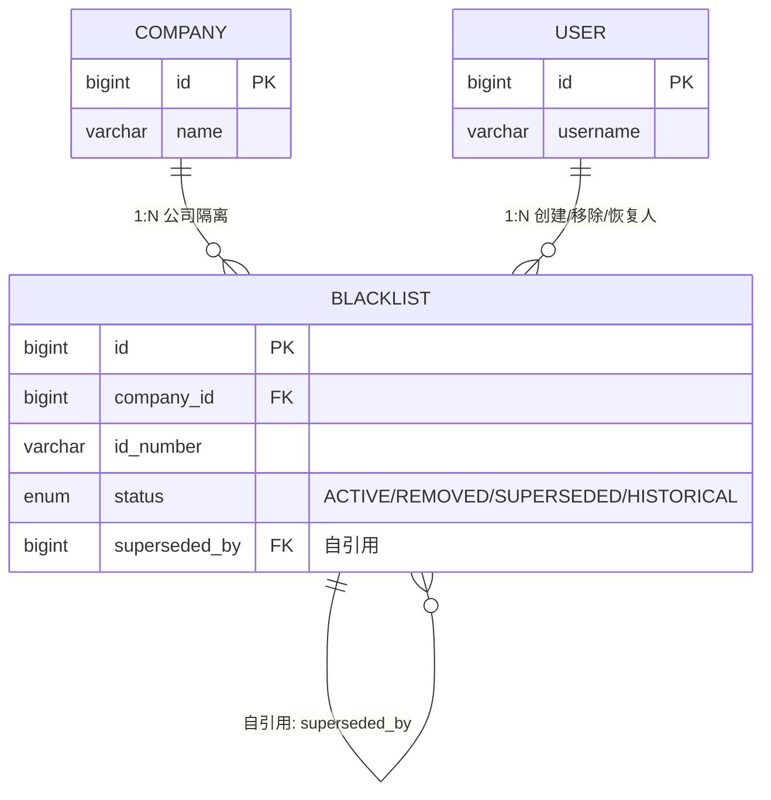

# ER 关系图模板

> 复制本文件, 重命名为 `er-diagram.md` 放到 `knowledge/db/`。
> 本文件是**全局 ER 图**(跨表关系),单表结构请用 `db-table.md`。

## 全局 ER 图(mermaid)

## 关系说明

| 关系 | 从 | 到 | 类型 | 是否显式 FK | 说明 |
|---|---|---|---|---|---|
| 公司 → 黑名单 | `company.id` | `blacklist.company_id` | 1:N | 否(应用层校验) | 多公司隔离 |
| 用户 → 黑名单(创建人) | `user.id` | `blacklist.created_by` | 1:N | 否 | - |
| 用户 → 黑名单(移除人) | `user.id` | `blacklist.removed_by` | 1:N | 否 | - |
| 用户 → 黑名单(恢复人) | `user.id` | `blacklist.restored_by` | 1:N | 否 | v3 新增 |
| 黑名单自引用 | `blacklist.id` | `blacklist.superseded_by` | 1:N | 否 | v3 合并取代 |

## 关键约束(跨表)

- 项目**不强制数据库外键**(便于快速迭代),关系完整性靠应用层校验
- `blacklist.company_id + id_type + id_number` 在 `status='ACTIVE'` 下软唯一(v3 方案 C,详见 `db/blacklist.md`)

## 关联

- 单表详情: `db/{table}.md`
- 取代决策: `adr/0001-bl12-restore-strategy.md`
- 状态流转: `state-machines/blacklist.md`
