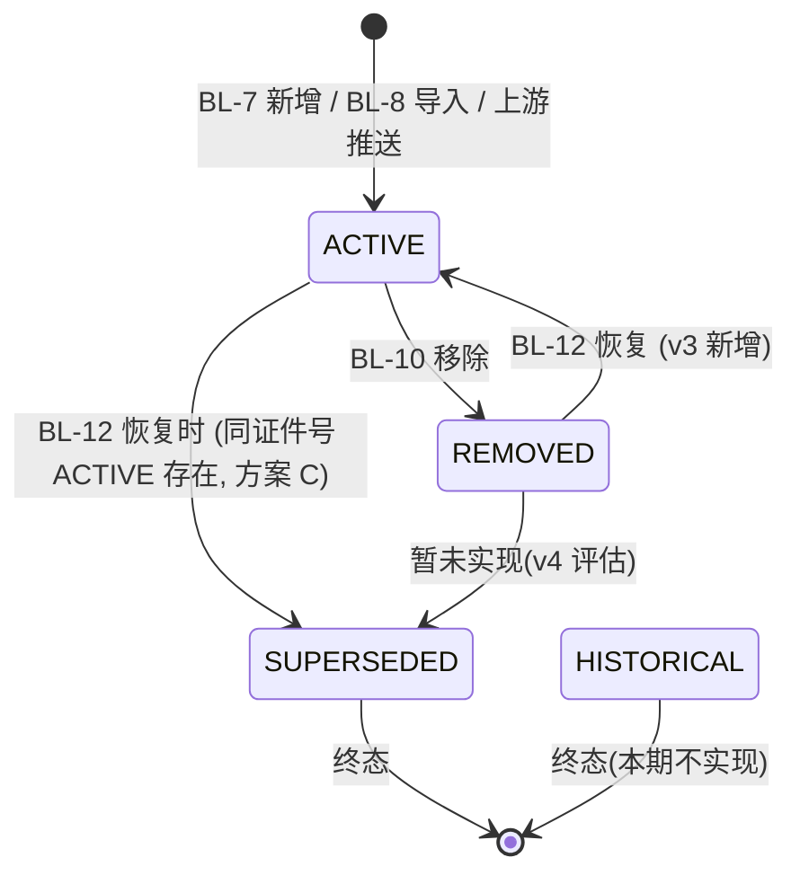

# 状态机模板

> 复制本文件, 重命名为 `{entity}.md` 放到 `.hl/knowledge/state-machines/`

## 实体信息

| 项 | 值 |
|---|---|
| 实体名 | `blacklist` (黑名单记录) |
| 字段 | `status` ENUM |
| 引入版本 | v1 初始 / v3 扩展 |
| 当前版本 | v3 |

## 状态列表

| 状态 | 含义 | 列表可见 | 终态? | 引入版本 |
|---|---|---|---|---|
| `ACTIVE` | 活跃状态, 默认显示 | ✅ | ❌ | v1 |
| `REMOVED` | 已软删除, 需"显示已移除"开关才可见 | ✅ | ❌ | v1 |
| `SUPERSEDED` | 被合并取代(同证件号恢复时级联) | ❌ | ✅ | v3 |
| `HISTORICAL` | 归档终态(本期 v3 不实现, 预留) | ❌ | ✅ | v3 |

## 流转图

## 转移条件(总表)

| From | To | 触发 | 关联 BL | 权限 |
|---|---|---|---|---|
| (无) | ACTIVE | 表单新增 | BL-7 | `blacklist:create` |
| (无) | ACTIVE | Excel 导入 | BL-8 | `blacklist:import` |
| (无) | ACTIVE | 上游推送 | (约定接口, 本项目不实现) | 系统 |
| ACTIVE | REMOVED | 操作列"移除" | BL-10 | `blacklist:remove` |
| REMOVED | ACTIVE | 操作列"恢复" | BL-12 | `blacklist:restore` |
| ACTIVE | SUPERSEDED | BL-12 恢复时(同证件号 ACTIVE 存在) | BL-12 | `blacklist:restore`(级联) |

## 终态规则

| 终态 | 列表可见 | DB 保留 | 审计可查 |
|---|---|---|---|
| SUPERSEDED | ❌ 永不显示 | ✅ | ✅ |
| HISTORICAL | ❌ 永不显示(本期不触发) | ✅ | ✅ |

## 关联

- 业务规则: `docs/v3/prd.md §12 BL-12`(恢复 + 合并)
- 数据库: `.hl/knowledge/db/blacklist.md §状态枚举扩展历史`
- ADR: `.hl/knowledge/adr/0001-bl12-restore-strategy.md`
- 枚举: `.hl/knowledge/enums/blacklist-status.md`